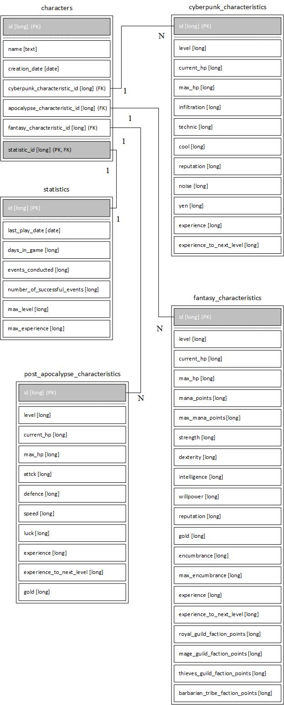

# Структура приложения ***DarkShell***

***

## Содержание

- [Содержание](#содержание)
- [1 - Функциональные возможности приложения](#1---функциональные-возможности-приложения)
- [2 - Выбор архитектуры приложения](#2---выбор-архитектуры-приложения)
- [3 - Выбор языка программирования](#3---выбор-языка-программирования)
- [4 - Технологии хранения данных](#4---технологии-хранения-данных)
- [5 - Набор элементов системы](#5---набор-элементов-системы)
- [6 - Схема хранения данных](#6---схема-хранения-данных)
- [7 - Перечень вспомогательных инструментов](#7---перечень-вспомогательных-инструментов)

***

## 1 - Функциональные возможности приложения

Симулятор ***DarkShell*** предназначен для переключения внимания с рабочих задач для повышения продуктивности.

Приложение имеет следующий функционал:

* **Генерация врагов**
* **Поддержка тактик хода**
* **Поддержка трёх сеттингов**
* **Использование системы характеристик**
* **Графический интерфейс**
* **Возможность сохранения текущего прогресса**
* **Возможность загрузки текущего прогресса**

***

## 2 - Выбор архитектуры приложения

Так как в приложении обозначена необходимость взаимодействия одного пользователей с одним хранилищем данных
и необходимость развёртывания на одной машине, в таком случае подойдёт монолитная архитектура.

***

## 3 - Выбор языка программирования

В функциональных требованиях приложения можно четко выделить бизнес сущности приложения (враги, персонажи, локации и т.д.), потому следует использовать подходящую методологию, в данном случае это ООП (объектно-ориентированное программирование). Приложение должно быть устойчиво к смене среды исполнения (ОС). Для всех этих целей подойдет язык Java.

***

## 4 - Технологии хранения данных

Хранение информации будет осуществляться путём использования БД SQLite.

IDEF1X схема БД:

Сущности и их поля в БД:

1. **characters** (персонажи)
2. **characters.id** (номер персонажа, первичный ключ, тип данных long)
3. **characters.name** (имя персонажа, тип данных text)
4. **characters.creation_date** (дата создания персонажа, тип данных date)
5. **characters.cyberpunk_characteristic_id** (номер характеристик персонажа в киберпанк сеттинге, внешний ключ, тип данных long)
6. **characters.apocalypse_characteristic_id** (номер характеристик персонажа в сеттинге пост апокалипсиса, внешний ключ, тип данных long)
7. **characters.fantasy_characteristic_id** (номер характеристик персонажа в фэнтези сеттинге, внешний ключ, тип данных long)
8. **characters.statistic_id** (номер статистики персонажа, первичный ключ, внешний ключ, тип данных long)
9. **cyberpunk_characteristics** (характеристики персонажей в киберпанк сеттинге)
10. **cyberpunk_characteristics.id** (номер характеристики, первичный ключ, тип данных long)
11. **cyberpunk_characteristics.level** (уровень персонажа, тип данных long)
12. **cyberpunk_characteristics.current_hp** (текущее здоровье персонажа, тип данных long)
13. **cyberpunk_characteristics.max_hp** (максимальное здоровье персонажа, тип данных long)
14. **cyberpunk_characteristics.infiltration** (инфильтрация персонажа, тип данных long)
15. **cyberpunk_characteristics.technic** (уровень навыка техники персонажа, тип данных long)
16. **cyberpunk_characteristics.cool** (уровень холоднокровия персонажа, тип данных long)
17. **cyberpunk_characteristics.reputation** (уровень репутации персонажа, тип данных long)
18. **cyberpunk_characteristics.noise** (уровень шума от персонажа, тип данных long)
19. **cyberpunk_characteristics.yen** (валюта персонажа, тип данных long)
20. **cyberpunk_characteristics.experience** (опыт персонажа, тип данных long)
21. **cyberpunk_characteristics.experience_to_next_level** (необходимый опыт для получения следующего уровня для персонажа, тип данных long)
22. **fantasy_characteristics** (характеристики персонажей в фэнтези сеттинге)
23. **fantasy_characteristics.id** (номер характеристики, первичный ключ, тип данных long)
24. **fantasy_characteristics.level** (уровень персонажа, тип данных long)
25. **fantasy_characteristics.current_hp** (текущее здоровье персонажа, тип данных long)
26. **fantasy_characteristics.current_hp** (текущее здоровье персонажа, тип данных long)
27. **fantasy_characteristics.mana_points** (текущая манна персонажа, тип данных long)
28. **fantasy_characteristics.max_mana_points** (максимальная манна персонажа, тип данных long)
29. **fantasy_characteristics.strength** (физическая сила персонажа, тип данных long)
30. **fantasy_characteristics.dexterity** (ловкость персонажа, тип данных long)
31. **fantasy_characteristics.intelligence** (разум персонажа, тип данных long)
32. **fantasy_characteristics.willpower** (сила воли персонажа, тип данных long)
33. **fantasy_characteristics.reputation** (репутация персонажа, тип данных long)
34. **fantasy_characteristics.gold** (золото персонажа, тип данных long)
35. **fantasy_characteristics.encumbrance** (текущий переносимый вес персонажа, тип данных long)
36. **fantasy_characteristics.max_encumbrance** (максимальный переносимый вес персонажа, тип данных long)
37. **fantasy_characteristics.experience** (опыт персонажа, тип данных long)
38. **fantasy_characteristics.experience_to_next_level** (необходимый опыт для получения следующего уровня для персонажа, тип данных long)
39. **fantasy_characteristics.royal_guild_faction_points** (очки королевской гильдии, тип данных long)
40. **fantasy_characteristics.mage_guild_faction_points** (очки фракции магов, тип данных long)
41. **fantasy_characteristics.thieves_guild_faction_points** (очки фракции воров, тип данных long)
42. **fantasy_characteristics.barbarian_tribe_faction_points** (очки племени варваров, тип данных long)
43. **post_apocalypse_characteristics** (характеристики персонажей в сеттинге постапокалипсиса)
44. **post_apocalypse_characteristics.id** (номер характеристики, первичный ключ, тип данных long)
45. **post_apocalypse_characteristics.level** (уровень персонажа, тип данных long)
46. **post_apocalypse_characteristics.current_hp** (текущее здоровье персонажа, тип данных long)
47. **post_apocalypse_characteristics.current_hp** (текущее здоровье персонажа, тип данных long)
48. **post_apocalypse_characteristics.attack** (сила атаки персонажа, тип данных long)
49. **post_apocalypse_characteristics.defence** (защита персонажа, тип данных long)
50. **post_apocalypse_characteristics.speed** (скорость персонажа, тип данных long)
51. **post_apocalypse_characteristics.luck** (удача персонажа, тип данных long)
52. **post_apocalypse_characteristics.experience** (опыт персонажа, тип данных long)
53. **post_apocalypse_characteristics.experience_to_next_level** (необходимый опыт для получения следующего уровня для персонажа, тип данных long)
54. **post_apocalypse_characteristics.gold** (золото персонажа, тип данных long)
55. **statistics** (статистика персонажа)
56. **statistics.id** (номер статистика персонажа, первичный ключ, тип данных long)
57. **statistics.last_play_date** (дата последней игры персонажа, тип данных date)
58. **statistics.days_in_game** (количество дней в игре за персонажа, тип данных long)
59. **statistics.events_conducted** (количество произошедших событий в мире, тип данных long)
60. **statistics.number_of_successful_events** (количество успешных событий в мире, тип данных long)
61. **statistics.max_level** (максимально достигнутый уровень персонажа, тип данных long)
62. **statistics.max_experience** (максимально достигнутый опыт персонажа, тип данных long)

***

## 5 - Набор элементов системы

UML схема приложения:

Элементы системы:

1. **App** (точка входа в программу)
2. **Utils** (вспомогательные классы)
3. **Utils.Config** (класс предоставляющий доступ и реализующий конфигурацию приложения)
4. **Utils.Logger** (класс для журналирования событий приложения)
5. **Utils.Constants** (класс с константами приложения)
6. **Utils.SupportFunctions** (класс со вспомогательными функциями)
7. **Utils.HibernateConfiguration** (класс предоставляющий доступ и реализующий конфигурацию БД приложения)
8. **Utils.CustomSQLiteDialect** (класс реализующий диалект СУБД SQLite для Hibernate)
9. **Models** (модели приложения)
10. **Models.Post apocalypse** (модели приложения в сеттинге постапокалипсиса)
11. **Models.Post apocalypse.Hero** (класс реализующий персонажа в сеттинге постапокалипсиса)
12. **Models.Post apocalypse.Location** (класс реализующий игровую локацию в сеттинге постапокалипсиса)
13. **Models.Post apocalypse.Enemy** (класс реализующий врага в сеттинге постапокалипсиса)
14. **Models.Post apocalypse.CombatInitiative** (класс реализующий инициативу боя в сеттинге постапокалипсиса)
15. **Models.Post apocalypse.UsersMove** (класс реализующий ход персонажа в сеттинге постапокалипсиса)
16. **Models.Post apocalypse.EnemysMove** (класс реализующий ход врага в сеттинге постапокалипсиса)
17. **Models.Post apocalypse.Reward** (класс реализующий награду персонажа в сеттинге постапокалипсиса)
18. **Models.Cyberpunk** (модели приложения в киберпанк сеттинге)
19. **Models.Cyberpunk.Hero** (класс реализующий персонажа в киберпанк сеттинге)
20. **Models.Cyberpunk.Location** (класс реализующий игровую локацию в киберпанк сеттинге)
21. **Models.Cyberpunk.Enemy** (класс реализующий врага в киберпанк сеттинге)
22. **Models.Cyberpunk.CombatInitiative** (класс реализующий инициативу боя в киберпанк сеттинге)
23. **Models.Cyberpunk.UsersMove** (класс реализующий ход персонажа в киберпанк сеттинге)
24. **Models.Cyberpunk.EnemysMove** (класс реализующий ход врага в киберпанк сеттинге)
25. **Models.Cyberpunk.Reward** (класс реализующий награду персонажа в киберпанк сеттинге)
26. **Models.Fantasy** (модели приложения в фэнтези сеттинге)
27. **Models.Fantasy.Hero** (класс реализующий персонажа в фэнтези сеттинге)
28. **Models.Fantasy.Location** (класс реализующий игровую локацию в фэнтези сеттинге)
29. **Models.Fantasy.Enemy** (класс реализующий врага в фэнтези сеттинге)
30. **Models.Fantasy.CombatInitiative** (класс реализующий инициативу боя в фэнтези сеттинге)
31. **Models.Fantasy.UsersFightMove** (класс реализующий ближний бой героя в фэнтези сеттинге)
32. **Models.Fantasy.UsersMagicalMove** (класс реализующий магию героя в фэнтези сеттинге)
33. **Models.Fantasy.EnemysMove** (класс реализующий ход врага в фэнтези сеттинге)
34. **Models.Fantasy.Reward** (класс реализующий награду персонажа в фэнтези сеттинге)
35. **GUI** (графический интерфейс приложения)
36. **GUI.MenuWindow** (окно меню приложения)
37. **GUI.SaveLoadWindow** (окно сохранения/загрузки приложения)
38. **GUI.OptionsWindow** (окно настроек приложения)
39. **GUI.GameWindow** (игровое окно приложения)
40. **Controllers** (классы с бизнес логикой приложения)
41. **Controllers.PostApocalypseGameController** (бизнес логика игры в сеттинге постапокалипсиса)
42. **Controllers.CyberpunkGameController** (бизнес логика игры в киберпанк сеттинге)
43. **Controllers.FantasyGameController** (бизнес логика игры в фэнтези сеттинге)
44. **Controllers.GameOperationsController** (бизнес логика сохранения, загрузки и настройки игры)
45. **DAO** (классы с логикой доступа к данным)
46. **GUI.CharactersDAO** (класс с логикой доступа к данным персонажей)
47. **GUI.StatisticsDAO** (класс с логикой доступа к данным статистики игр)
48. **GUI.CyberpunkCharacteristicsDAO** (класс с логикой доступа к данным персонажа в киберпанк сеттинге)
49. **GUI.FantasyCharacteristicsDAO** (класс с логикой доступа к данным персонажа в фэнтези сеттинге)
50. **GUI.PostApocalypseCharacteristicsDAO** (класс с логикой доступа к данным персонажа в сеттинге постапокалипсиса)

***

## 6 - Схема хранения данных

В приложении осуществляется хранение данных о последнем игровом процессе и игровой статистике персонажа, новые элементы игрового процесса получаются путём процедурной генерации.

Имеется поддержка и загрузка сохранений из файлов специального формата.

***

## 7 - Перечень вспомогательных инструментов

Ниже приведён перечень вспомогательных инструментов, которые использовались при разработке приложения.

Инструменты для разработки:

* **Eclipse / NetBeans / IDEA (среда разработки)**
* **Maven / Gradle (сборщик проектов)**
* **JDK**
* **Notepad++**
* **SQLiteDatabaseBrowserPortable**
* **WindowsPowerShell**

Библиотеки:

* **Hibernate**
* **Launch4J**
* **SWING**
* **FlatLAF**
* **Google Simple JSON**
